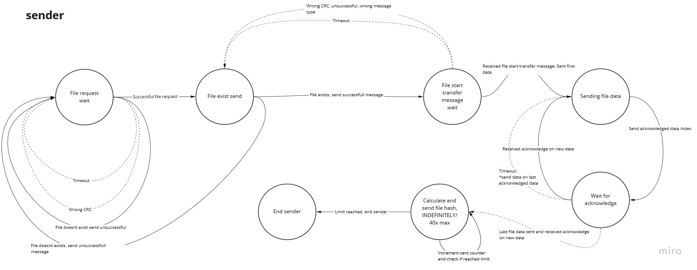
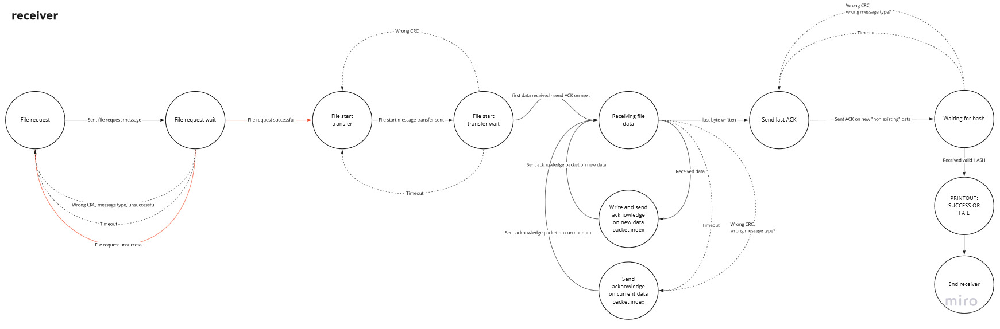
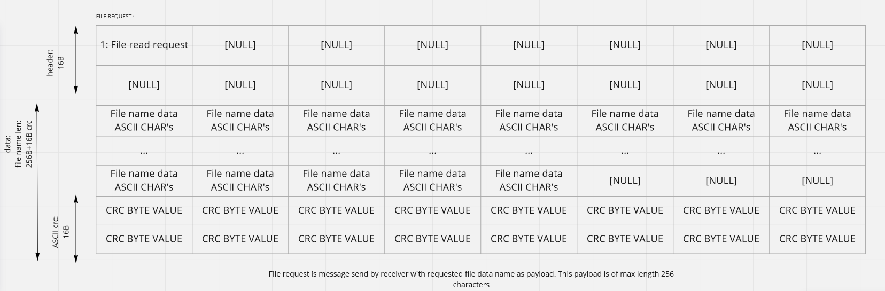
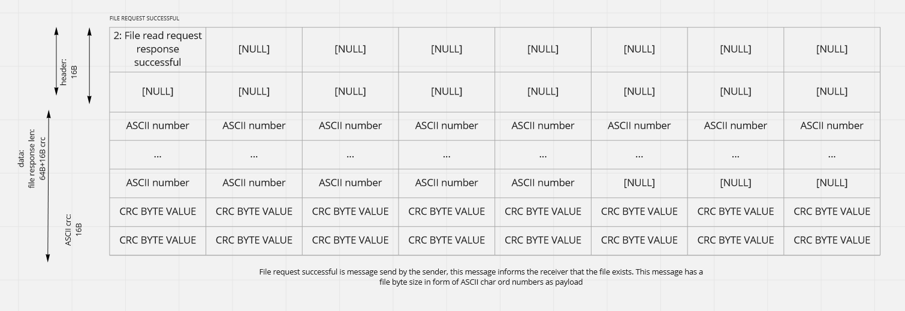
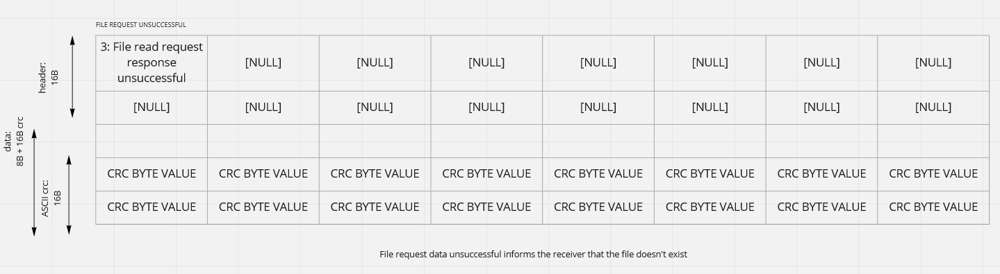
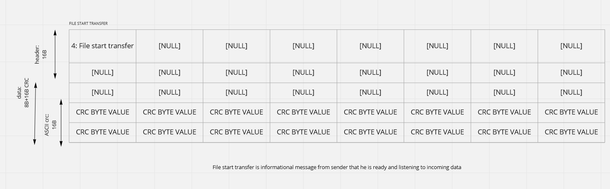
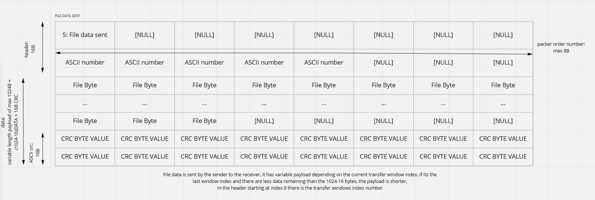
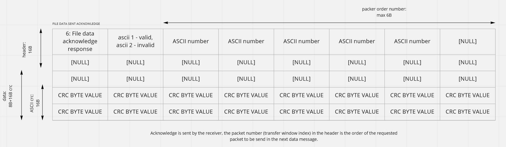
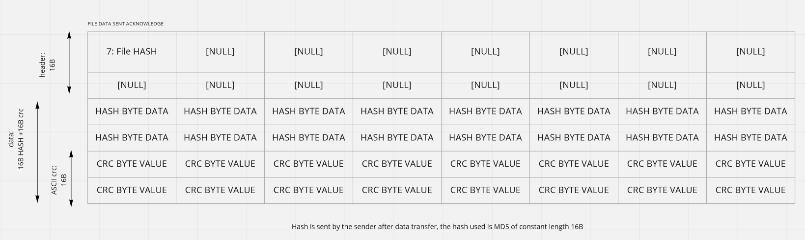

#  Reliable data transfer with UDP and Python

5.1.2022

Final assigment for networking class, Python implementation of reliable file transfer with unreliable UDP in Python.


The goal of this implementation was to develop reliable error detection and correction on top of unreliable UDP data transfer.
This implementation is not fast by any means and should not be used for practical purposes.

- Error detection is impemented with 128 bit CRC + file corruption detection is implemented with 128 bit MD5 HASH function
- Error correction works as a stop and wait protocol

Current settings show working prototype of file receiver and file sender running on local machine.
- "state_sender_application.py" acts as a sender which has the file that "state_receiver_application.py" wants, "state_receiver_application.py"
needs to specify path to the wanted file in the "state_receiver_application.py". 
- All sender ports in sender have to match receiver ports in receiver and 
all receiver ports in sender have to match sender ports in receiver as well as IPs -> these constants are marked in each file with 3 stars in the comments
at the beggining of both files. 

It is possible to simulate unreliable data transfer with program in n3td3rp3r.zip, which acts as a middle man which flips bits, delays messages, 
or deletes messages with some probability that is configurable in Config.json within the n3td3rp3r.zip file.
Computer running a sender application "state_sender_application.py" will also have n3td3rp3r running in the background with configured connection parameters, such as
correct IP for sender and receiver and sender and receiver ports.

Program is a state machine with special messages documented in "documentation/".

- "protocol_descriptors.py" contains all the configuration for the reliable protocol build on top of UDP.
- "UDPFile_receiver.py"/"UDPFile_sender.py" contains objects for receiver and sender respectively.

## Python libraries requierement
- Python (Tested with Python 3.7 and 3.10)
- CRC (Tested on version 1.1.2)
```python
pip install crc
```

- NumPy (Tested on version 1.22.2)
```python
pip install numpy
```

## Current protocol settings (for local machine)

(a) state_sender_application <-> ~~(b) n3td3rp3r~~ <-> (c) state_receiver_application

|       Application      |       a       | b |       c       |
|:----------------------:|:-------------:|:-:|:-------------:|
|       Machine IP       |   127.0.0.1   | - |   127.0.0.1   |
|   Send data target IP  |   127.0.0.1   | - |   127.0.0.1   |
|  Send data target port |      5040     | - |      5009     |
|  Receive data from IP  |   127.0.0.1   | - |   127.0.0.1   |
| Receive data from port |      5009     | - |      5040     |

## Protocol state machines

### Sender (state_sender_application.py)



### Receiver (state_receiver_application.py)



## Messages 

### 1. File request from receiver



### 2. File request response from sender (successful)



### 3. File request response from sender (unsuccessful)



### 4. Start transfer from receiver



### 5. File data from sender



### 6. File data acknowledge from sender



### 7. File hash data from sender



Images produced with a tool Miro (miro.com).